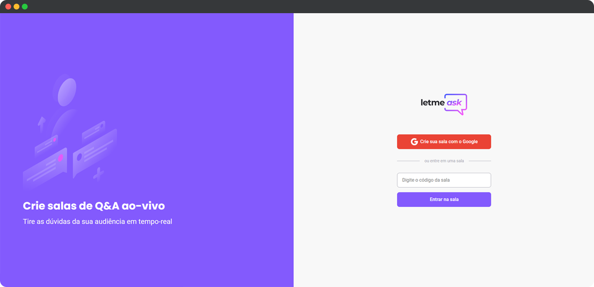

<h1 align="center">
  
</h1>

<p align="center">
  

  
</p>

<br>

<p align="center">
  
</p>

<br>

## 🧪 Tecnologias

Esse projeto foi desenvolvido com as seguintes tecnologias:

- [React](https://reactjs.org)
- [Firebase](https://firebase.google.com/)
- [TypeScript](https://www.typescriptlang.org/)

## 💻 Projeto

O Letmeask é um website perfeito para você que busca ter um contato mais próximo com o seu público ou com outras pessoas, onde podem criar salas de Q&A de forma organizada, prática e agradável.

O Letmeask foi desenvolvido pensando em oferecer o funcional de forma organizada, prática e agradável.

Ele possui uma interface clean, moderna e coerente com o conceito de realtime que contribui principalmente na funcionalidade de enviar perguntas/respostas e realizar interações nelas, onde tudo ocorre em tempo real para todos que estiverem na sala.

Como a intenção é oferecer algo organizado, prático e agradável para todos, o Letmeask conta com um sistema de administração das salas de Q&A, onde o criador dela, automaticamente ganha superpoderes ao acessá-la. 😉

Você consegue e pode fazer se desejar, interações nas perguntas/respostas, como:

- Curtir
- Dar destaque
- Marcar como respondido
- Excluir

**Lembrando que essas três últimas interações só será possível se você for o admin da sala.** 🕵️‍♀️

O admin, recebe também o superpoder de encerrar a sala quando desejar, mas tome cuidado, essa ação **não tem como voltar atrás**. ⚠️

Está presente também, o famoso e querido Dark Mode 🌗, hoje em dia quase tudo possui uma versão escura e o Letmeask não poderia ficar sem.

É uma versão simples, tem muitas outras coisas que podem ser implementadas e melhoradas, mas apesar de simples, é funcional, cumpre o que oferece.

Este é um projeto desenvolvido durante a **[Next Level Week #06](https://nextlevelweek.com/)**, apresentada nos dias 20 a 27 de Junho de 2021.

## 🔖 Layout

Você pode visualizar o layout do projeto através do link abaixo:

- [Layout Web](https://www.figma.com/file/u0BQK8rCf2KgzcukdRRCWh/Letmeask/duplicate)

É necessário ter uma conta no [Figma](http://figma.com/) para acessá-lo.

## 🚀 Como executar

Clone o projeto e acesse a pasta do mesmo.

```bash
$ git clone https://github.com/rafaelramosdev/nlw-06-reactjs
$ cd nlw-06-reactjs
```

Para iniciá-lo, siga os passos abaixo:

```bash
# Instala as dependências
$ npm install

# Inicia o website
$ npm run start
```

O website estará disponível no seu navegador pelo endereço [`http://localhost:3000`](http://localhost:3000).

É necessário criar uma conta no [Firebase](https://firebase.google.com/) e um projeto para disponibilizar um Realtime Database.

## 📄 Licença

Esse projeto está sob a licença MIT. Veja o arquivo [LICENSE](LICENSE) para mais detalhes.

---

Fique ligado nas próximas edições do [Next Level Week](https://nextlevelweek.com/), é um evento gratuito que você não pode deixar passar, recomendo muito!

Feito by [Rafael Ramos](https://rafaelramos.dev/) 🙋🏻‍♂️
